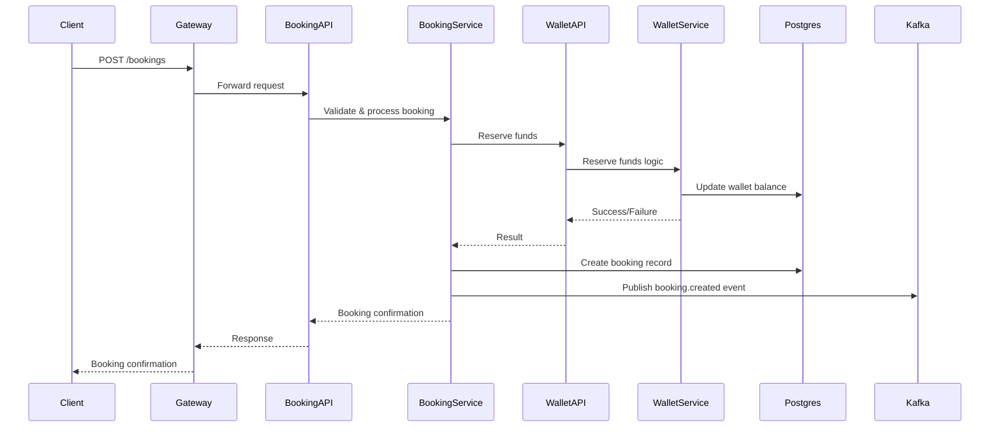

# Data Flow Overview

This document explains how data moves between clients, services, and databases in the dn-ms Rust monorepo. It covers typical request/response flows, inter-service communication, and event-driven patterns.

---

## 1. Client to API
- Clients (web, mobile, or other services) send HTTP requests to API endpoints (Axum routers in `apis/`).
- Requests are validated, authenticated, and routed to the appropriate handler.

## 2. API to Service Layer
- The API handler extracts data and calls the corresponding service logic (in `features/<service>/service/`).
- Business rules, validation, and orchestration are applied.

## 3. Service to Repository/Database
- The service layer interacts with the repository layer (`features/<service>/repo/`) to fetch or mutate data.
- The repository uses SeaORM to query or update PostgreSQL.
- Data is mapped between database entities and DTOs/models.

## 4. Service to Other Services
- For cross-cutting concerns (e.g., authentication, notifications, payments), services call each other via HTTP (remote clients in `features/<service>/remote/`) or publish events to Kafka (`features/<service>/stream/`).
- Example: Booking service requests wallet service to reserve funds, or publishes a booking event to Kafka.

## 5. Event-Driven Communication
- Services publish domain events to Kafka topics (e.g., booking.created, payment.completed).
- Other services consume these events asynchronously for eventual consistency, notifications, or further processing.

## 6. Caching & Idempotency
- Redis is used for caching frequently accessed data, distributed locks, and idempotency keys.
- Example: Preventing duplicate payment processing or caching user sessions.

## 7. Observability
- All requests, events, and database operations are instrumented with OpenTelemetry and sent to Jaeger/OpenObserve for tracing and monitoring.

---

## Example: Booking Flow

---

## Notes
- All data access is secured and audited.
- Each service owns its data and exposes only necessary APIs/events.
- Event-driven flows enable loose coupling and scalability.
