```mermaid
flowchart TD
    subgraph Gateway & Apps
        GW[Gateway]
        AUTHWEB[Auth Web]
        NOTIFYAPP[Notification App]
    end
    subgraph APIs
        AUTH[Auth Service]
        BOOKING[Booking Service]
        WALLET[Wallet Service]
        INVENTORY[Inventory Service]
        MERCHANT[Merchant Service]
        FEE[Fee Service]
        NOTIFY[Notification Service]
        PROFILE[Profile Service]
        TRANSLATION[Translation Service]
        LOOKUP[Lookup Service]
        BAKERY[Bakery Service]
        EMAILT[Email Template Service]
        EVENT[Event Service]
        PAYMENTCORE[Payment Core Service]
        STRIPE[Stripe Service]
    end
    subgraph Features & Shared
        FEAT[Feature Crates]
        SHARED[Shared Libraries]
    end
    subgraph Infra
        POSTGRES[(PostgreSQL)]
        REDIS[(Redis)]
        KAFKA[(Kafka)]
        CONSUL[(Consul)]
        OTEL[(OpenTelemetry)]
        JAEGER[(Jaeger)]
        OPENOBS[(OpenObserve)]
    end
    GW -->|HTTP| AUTH
    GW -->|HTTP| BOOKING
    GW -->|HTTP| WALLET
    GW -->|HTTP| INVENTORY
    GW -->|HTTP| MERCHANT
    GW -->|HTTP| FEE
    GW -->|HTTP| NOTIFY
    GW -->|HTTP| PROFILE
    GW -->|HTTP| TRANSLATION
    GW -->|HTTP| LOOKUP
    GW -->|HTTP| BAKERY
    GW -->|HTTP| EMAILT
    GW -->|HTTP| EVENT
    GW -->|HTTP| PAYMENTCORE
    GW -->|HTTP| STRIPE
    AUTHWEB --> AUTH
    NOTIFYAPP --> NOTIFY
    APIs --> FEAT
    FEAT --> SHARED
    APIs --> SHARED
    APIs -->|DB| POSTGRES
    APIs -->|Cache| REDIS
    APIs -->|Events| KAFKA
    APIs -->|Discovery| CONSUL
    APIs -->|Tracing| OTEL
    OTEL --> JAEGER
    OTEL --> OPENOBS
    GW -->|Discovery| CONSUL
    AUTHWEB -->|Discovery| CONSUL
    NOTIFYAPP -->|Discovery| CONSUL
    GW -->|Tracing| OTEL
    AUTHWEB -->|Tracing| OTEL
    NOTIFYAPP -->|Tracing| OTEL
```

# System Architecture Overview

This diagram illustrates the high-level architecture of the dn-ms Rust monorepo, showing the relationships between gateways, apps, APIs, feature/shared crates, and infrastructure services.

---

---

- Gateways and apps route requests to microservices (APIs).
- APIs use feature crates and shared libraries for business logic and data models.
- All services interact with infrastructure: PostgreSQL (DB), Redis (cache), Kafka (events), Consul (discovery), OpenTelemetry/Jaeger/OpenObserve (tracing/observability).
