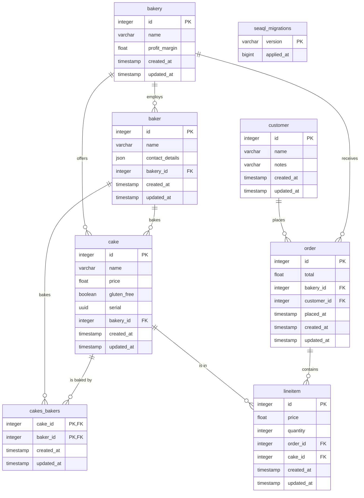

# Bakery Microservice Database Schema

## Entity Relationship Diagram (Mermaid)

## Database Schema (bakery)

### Tables

#### baker
| Column          | Type                | Default             | Constraints         |
|-----------------|---------------------|---------------------|---------------------|
| id              | integer             |                     | PK, NOT NULL        |
| name            | varchar             |                     | NOT NULL            |
| contact_details | json                |                     | NOT NULL            |
| bakery_id       | integer             |                     |                     |
| created_at      | timestamp           | CURRENT_TIMESTAMP   | NOT NULL            |
| updated_at      | timestamp           | CURRENT_TIMESTAMP   | NOT NULL            |

---

#### order
| Column      | Type      | Default           | Constraints         |
|-------------|-----------|-------------------|---------------------|
| id          | integer   |                   | PK, NOT NULL        |
| total       | float     |                   | NOT NULL            |
| bakery_id   | integer   |                   | NOT NULL, FK        |
| customer_id | integer   |                   | NOT NULL, FK        |
| placed_at   | timestamp |                   | NOT NULL            |
| created_at  | timestamp | CURRENT_TIMESTAMP | NOT NULL            |
| updated_at  | timestamp | CURRENT_TIMESTAMP | NOT NULL            |

---

#### cake
| Column      | Type      | Default           | Constraints         |
|-------------|-----------|-------------------|---------------------|
| id          | integer   |                   | PK, NOT NULL        |
| name        | varchar   |                   | NOT NULL            |
| price       | float     |                   | NOT NULL            |
| gluten_free | boolean   |                   | NOT NULL            |
| serial      | uuid      |                   | UNIQUE, NOT NULL    |
| bakery_id   | integer   |                   | NOT NULL, FK        |
| created_at  | timestamp | CURRENT_TIMESTAMP | NOT NULL            |
| updated_at  | timestamp | CURRENT_TIMESTAMP | NOT NULL            |

---

#### customer
| Column      | Type      | Default           | Constraints         |
|-------------|-----------|-------------------|---------------------|
| id          | integer   |                   | PK, NOT NULL        |
| name        | varchar   |                   | NOT NULL            |
| notes       | varchar   |                   |                     |
| created_at  | timestamp | CURRENT_TIMESTAMP | NOT NULL            |
| updated_at  | timestamp | CURRENT_TIMESTAMP | NOT NULL            |

---

*Add more tables below following this format.*

#### bakery
| Column        | Type      | Default           | Constraints         |
|--------------|-----------|-------------------|---------------------|
| id           | integer   |                   | PK, NOT NULL        |
| name         | varchar   |                   | NOT NULL            |
| profit_margin| float     |                   | NOT NULL            |
| created_at   | timestamp | CURRENT_TIMESTAMP | NOT NULL            |
| updated_at   | timestamp | CURRENT_TIMESTAMP | NOT NULL            |

---

#### cakes_bakers
| Column      | Type      | Default           | Constraints         |
|-------------|-----------|-------------------|---------------------|
| cake_id     | integer   |                   | PK, NOT NULL, FK    |
| baker_id    | integer   |                   | PK, NOT NULL, FK    |
| created_at  | timestamp | CURRENT_TIMESTAMP | NOT NULL            |
| updated_at  | timestamp | CURRENT_TIMESTAMP | NOT NULL            |

---

#### lineitem
| Column      | Type      | Default           | Constraints         |
|-------------|-----------|-------------------|---------------------|
| id          | integer   |                   | PK, NOT NULL        |
| price       | float     |                   | NOT NULL            |
| quantity    | integer   |                   | NOT NULL            |
| order_id    | integer   |                   | NOT NULL, FK        |
| cake_id     | integer   |                   | NOT NULL, FK        |
| created_at  | timestamp | CURRENT_TIMESTAMP | NOT NULL            |
| updated_at  | timestamp | CURRENT_TIMESTAMP | NOT NULL            |

---

#### seaql_migrations
| Column      | Type      | Default | Constraints         |
|-------------|-----------|---------|---------------------|
| version     | varchar   |         | PK                  |
| applied_at  | bigint    |         | NOT NULL            |

---
