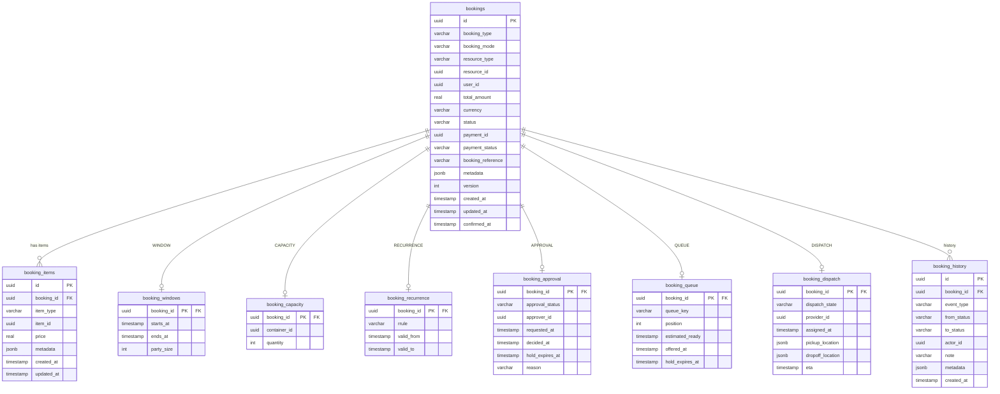

# Booking Microservice Database Schema

Generalized multi-type booking schema: a core `bookings` table, a `booking_items`
line-item table, and one child table per booking mode. `booking_mode` selects
which child table applies to a given booking.

## Entity Relationship Diagram (Mermaid)

## Database Schema (booking)

### Core

#### bookings
| Column             | Type        | Default             | Constraints  |
|--------------------|-------------|---------------------|--------------|
| id                 | uuid        | gen_random_uuid()   | PK, NOT NULL |
| booking_type       | varchar     |                     | NOT NULL     |
| booking_mode       | varchar     |                     | NOT NULL     |
| resource_type      | varchar     |                     | NULL         |
| resource_id        | uuid        |                     | NULL         |
| user_id            | uuid        |                     | NOT NULL     |
| total_amount       | real        | 0                   | NOT NULL     |
| currency           | varchar     | 'USD'               | NOT NULL     |
| status             | varchar     | 'PENDING'           | NOT NULL     |
| payment_id         | uuid        |                     | NULL         |
| payment_status     | varchar     | 'PENDING'           | NOT NULL     |
| booking_reference  | varchar(100)|                     | NOT NULL     |
| metadata           | jsonb       |                     | NULL         |
| version            | int         | 0                   | NOT NULL     |
| created_at         | timestamp   | CURRENT_TIMESTAMP   | NOT NULL     |
| updated_at         | timestamp   | CURRENT_TIMESTAMP   | NOT NULL     |
| confirmed_at       | timestamp   |                     | NULL         |

Indexes: `idx_bookings_user (user_id)`, `idx_bookings_type_status (booking_type, status)`,
`idx_bookings_resource (resource_type, resource_id)`, `idx_bookings_reference (booking_reference)`.

#### booking_items
| Column      | Type      | Default           | Constraints                  |
|-------------|-----------|-------------------|------------------------------|
| id          | uuid      | gen_random_uuid() | PK, NOT NULL                 |
| booking_id  | uuid      |                   | NOT NULL, FK → bookings(id)  |
| item_type   | varchar   |                   | NOT NULL                     |
| item_id     | uuid      |                   | NOT NULL                     |
| price       | real      |                   | NOT NULL                     |
| metadata    | jsonb     |                   | NULL                         |
| created_at  | timestamp | CURRENT_TIMESTAMP | NOT NULL                     |
| updated_at  | timestamp | CURRENT_TIMESTAMP | NOT NULL                     |

Indexes: `idx_booking_items_booking (booking_id)`, `idx_booking_items_unit (item_type, item_id)`.
FK cascade: `ON DELETE CASCADE`.

#### booking_history (append-only lifecycle event log)
| Column      | Type        | Default           | Constraints                 |
|-------------|-------------|-------------------|-----------------------------|
| id          | uuid        | gen_random_uuid() | PK, NOT NULL                |
| booking_id  | uuid        |                   | NOT NULL, FK → bookings(id) |
| event_type  | varchar     |                   | NOT NULL (CREATED, STATUS_CHANGED, PAYMENT_UPDATED, CANCELLED) |
| from_status | varchar     |                   | NULL                        |
| to_status   | varchar     |                   | NULL                        |
| actor_id    | uuid        |                   | NULL                        |
| note        | varchar(500)|                   | NULL                        |
| metadata    | jsonb       |                   | NULL                        |
| created_at  | timestamp   | CURRENT_TIMESTAMP | NOT NULL                    |

Index: `idx_booking_history_booking (booking_id, created_at)`. FK cascade: `ON DELETE CASCADE`.
Append-only: no update/delete operations. Rows are written in the same transaction
as the booking change they record.

### Mode child tables

Each has `booking_id` as PK and FK → `bookings(id)` `ON DELETE CASCADE` (1:1).

#### booking_windows (mode = WINDOW)
| Column     | Type      | Constraints  |
|------------|-----------|--------------|
| booking_id | uuid      | PK, FK       |
| starts_at  | timestamp | NOT NULL     |
| ends_at    | timestamp | NOT NULL     |
| party_size | int       | NULL         |

Index: `idx_booking_windows_range (starts_at, ends_at)`.

#### booking_capacity (mode = CAPACITY)
| Column       | Type | Default | Constraints |
|--------------|------|---------|-------------|
| booking_id   | uuid |         | PK, FK      |
| container_id | uuid |         | NOT NULL    |
| quantity     | int  | 1       | NOT NULL    |

Index: `idx_booking_capacity_container (container_id)`.

#### booking_recurrence (mode = RECURRENCE)
| Column     | Type        | Constraints |
|------------|-------------|-------------|
| booking_id | uuid        | PK, FK      |
| rrule      | varchar(500)| NULL        |
| valid_from | timestamp   | NOT NULL    |
| valid_to   | timestamp   | NULL        |

#### booking_approval (mode = APPROVAL)
| Column          | Type        | Default           | Constraints |
|-----------------|-------------|-------------------|-------------|
| booking_id      | uuid        |                   | PK, FK      |
| approval_status | varchar     | 'PENDING'         | NOT NULL    |
| approver_id     | uuid        |                   | NULL        |
| requested_at    | timestamp   | CURRENT_TIMESTAMP | NOT NULL    |
| decided_at      | timestamp   |                   | NULL        |
| hold_expires_at | timestamp   |                   | NULL        |
| reason          | varchar(500)|                   | NULL        |

#### booking_queue (mode = QUEUE)
| Column          | Type        | Constraints |
|-----------------|-------------|-------------|
| booking_id      | uuid        | PK, FK      |
| queue_key       | varchar(100)| NOT NULL    |
| position        | int         | NULL        |
| estimated_ready | timestamp   | NULL        |
| offered_at      | timestamp   | NULL        |
| hold_expires_at | timestamp   | NULL        |

Index: `idx_booking_queue_key_pos (queue_key, position)`.

#### booking_dispatch (mode = DISPATCH)
| Column           | Type      | Default     | Constraints |
|------------------|-----------|-------------|-------------|
| booking_id       | uuid      |             | PK, FK      |
| dispatch_state   | varchar   | 'REQUESTED' | NOT NULL    |
| provider_id      | uuid      |             | NULL        |
| assigned_at      | timestamp |             | NULL        |
| pickup_location  | jsonb     |             | NULL        |
| dropoff_location | jsonb     |             | NULL        |
| eta              | timestamp |             | NULL        |

Index: `idx_booking_dispatch_provider (provider_id, dispatch_state)`.

#### seaql_migrations
| Column     | Type    | Constraints |
|------------|---------|-------------|
| version    | varchar | PK          |
| applied_at | bigint  | NOT NULL    |

## Notes
- `money` fields use `real` (f32) to match legacy columns. Consider migrating to
  integer minor units (`i64`) to align with the payment/wallet services and avoid
  float rounding.
- `version` on `bookings` is reserved for optimistic locking.
- Availability is enforced in the service transaction, not (yet) by DB constraints.
  A `EXCLUDE USING gist` overlap constraint on WINDOW is the recommended hardening.
