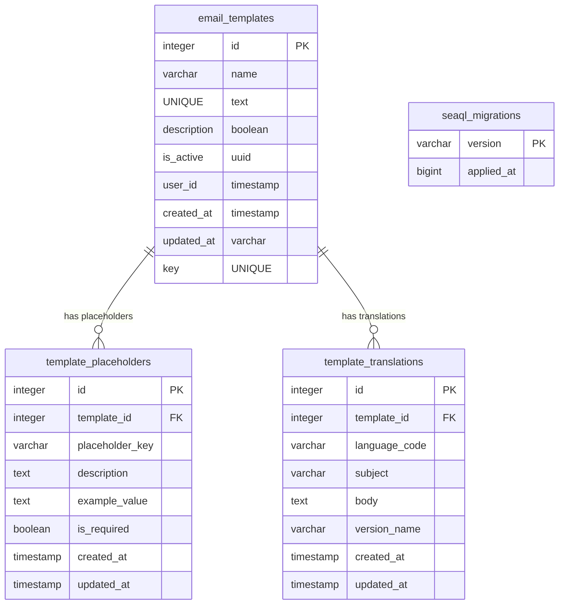

# Email Template Microservice Database Schema

## Entity Relationship Diagram (Mermaid)

## Database Schema (email_template)

### Tables

#### email_templates
| Column      | Type      | Default           | Constraints         |
|-------------|-----------|-------------------|---------------------|
| id          | integer   |                   | PK, NOT NULL        |
| name        | varchar(255)|                  | UNIQUE, NOT NULL    |
| description | text      |                   |                     |
| is_active   | boolean   | true              | NOT NULL            |
| user_id     | uuid      |                   | NOT NULL            |
| created_at  | timestamp | CURRENT_TIMESTAMP | NOT NULL            |
| updated_at  | timestamp | CURRENT_TIMESTAMP | NOT NULL            |
| key         | varchar(255)| ''               | UNIQUE, NOT NULL    |

---

#### template_placeholders
| Column         | Type      | Default           | Constraints         |
|----------------|-----------|-------------------|---------------------|
| id             | integer   |                   | PK, NOT NULL        |
| template_id    | integer   |                   | NOT NULL, FK        |
| placeholder_key| varchar(100)|                  | NOT NULL            |
| description    | text      |                   |                     |
| example_value  | text      |                   |                     |
| is_required    | boolean   | false             | NOT NULL            |
| created_at     | timestamp | CURRENT_TIMESTAMP | NOT NULL            |
| updated_at     | timestamp | CURRENT_TIMESTAMP | NOT NULL            |

---

#### template_translations
| Column        | Type      | Default           | Constraints         |
|---------------|-----------|-------------------|---------------------|
| id            | integer   |                   | PK, NOT NULL        |
| template_id   | integer   |                   | NOT NULL, FK        |
| language_code | varchar(10)|                   | NOT NULL            |
| subject       | varchar(255)|                  | NOT NULL            |
| body          | text      |                   | NOT NULL            |
| version_name  | varchar(50)|                   | NOT NULL            |
| created_at    | timestamp | CURRENT_TIMESTAMP | NOT NULL            |
| updated_at    | timestamp | CURRENT_TIMESTAMP | NOT NULL            |

---

#### seaql_migrations
| Column      | Type      | Default | Constraints         |
|-------------|-----------|---------|---------------------|
| version     | varchar   |         | PK                  |
| applied_at  | bigint    |         | NOT NULL            |

