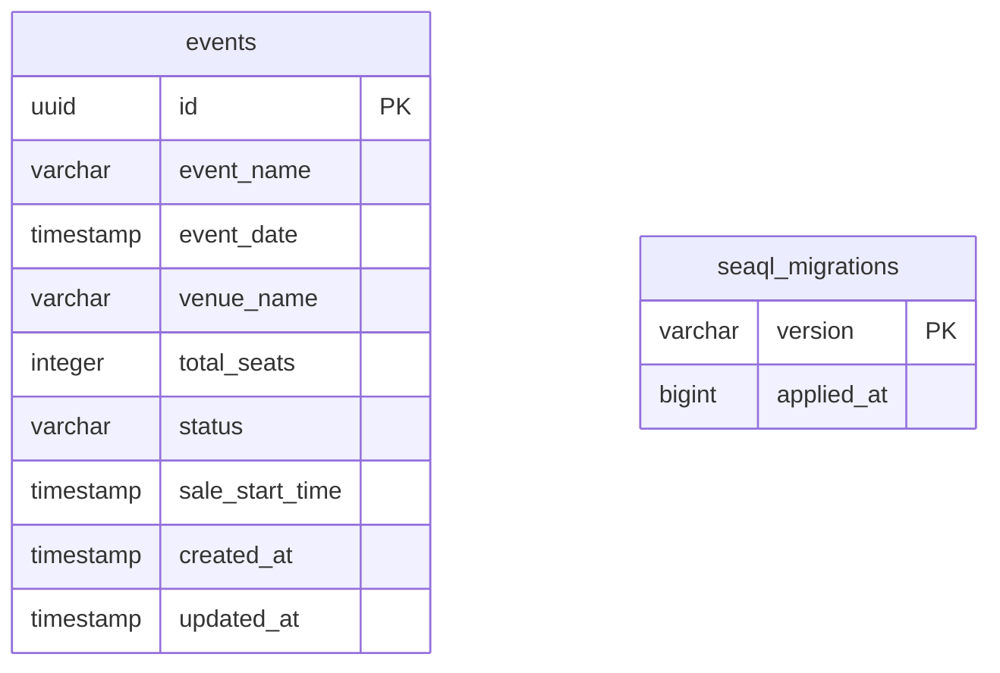

# Event Microservice Database Schema

## Entity Relationship Diagram (Mermaid)

## Database Schema (event)

### Tables

#### events
| Column        | Type      | Default           | Constraints         |
|--------------|-----------|-------------------|---------------------|
| id           | uuid      | gen_random_uuid() | PK, NOT NULL        |
| event_name   | varchar   |                   | NOT NULL            |
| event_date   | timestamp |                   | NOT NULL            |
| venue_name   | varchar   |                   |                     |
| total_seats  | integer   |                   | NOT NULL            |
| status       | varchar   | 'UPCOMING'        | NOT NULL            |
| sale_start_time | timestamp |                |                     |
| created_at   | timestamp | CURRENT_TIMESTAMP | NOT NULL            |
| updated_at   | timestamp | CURRENT_TIMESTAMP | NOT NULL            |

---

#### seaql_migrations
| Column      | Type      | Default | Constraints         |
|-------------|-----------|---------|---------------------|
| version     | varchar   |         | PK                  |
| applied_at  | bigint    |         | NOT NULL            |
