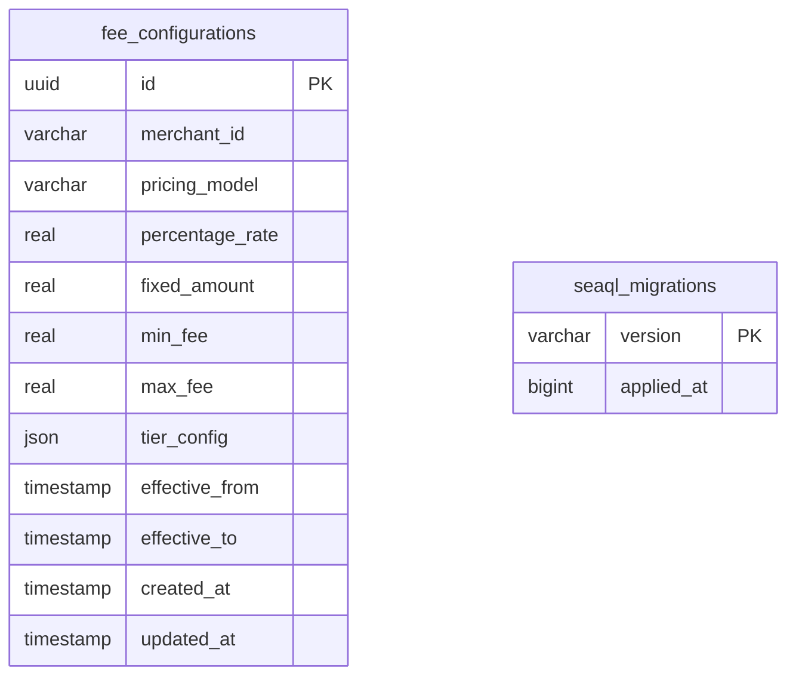

# Fee Microservice Database Schema

## Entity Relationship Diagram (Mermaid)

## Database Schema (fee)

### Tables

#### fee_configurations
| Column          | Type      | Default           | Constraints         |
|-----------------|-----------|-------------------|---------------------|
| id              | uuid      | gen_random_uuid() | PK, NOT NULL        |
| merchant_id     | varchar(50)|                  | NOT NULL            |
| pricing_model   | varchar(20)|                  | NOT NULL            |
| percentage_rate | real      |                   |                     |
| fixed_amount    | real      |                   |                     |
| min_fee         | real      |                   |                     |
| max_fee         | real      |                   |                     |
| tier_config     | json      |                   |                     |
| effective_from  | timestamp |                   |                     |
| effective_to    | timestamp |                   |                     |
| created_at      | timestamp | CURRENT_TIMESTAMP | NOT NULL            |
| updated_at      | timestamp | CURRENT_TIMESTAMP | NOT NULL            |

---

#### seaql_migrations
| Column      | Type      | Default | Constraints         |
|-------------|-----------|---------|---------------------|
| version     | varchar   |         | PK                  |
| applied_at  | bigint    |         | NOT NULL            |

