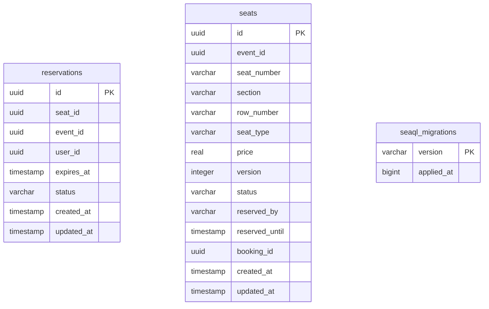

# Inventory Microservice Database Schema

## Entity Relationship Diagram (Mermaid)

## Database Schema (inventory)

### Tables

#### reservations
| Column      | Type      | Default           | Constraints         |
|-------------|-----------|-------------------|---------------------|
| id          | uuid      | gen_random_uuid() | PK, NOT NULL        |
| seat_id     | uuid      |                   | NOT NULL            |
| event_id    | uuid      |                   | NOT NULL            |
| user_id     | uuid      |                   | NOT NULL            |
| expires_at  | timestamp |                   | NOT NULL            |
| status      | varchar   | 'ACTIVE'          | NOT NULL            |
| created_at  | timestamp | CURRENT_TIMESTAMP | NOT NULL            |
| updated_at  | timestamp | CURRENT_TIMESTAMP | NOT NULL            |

---

#### seats
| Column         | Type      | Default           | Constraints         |
|----------------|-----------|-------------------|---------------------|
| id             | uuid      | gen_random_uuid() | PK, NOT NULL        |
| event_id       | uuid      |                   | NOT NULL            |
| seat_number    | varchar   |                   | NOT NULL            |
| section        | varchar   |                   |                     |
| row_number     | varchar   |                   |                     |
| seat_type      | varchar   | 'REGULAR'         | NOT NULL            |
| price          | real      |                   | NOT NULL            |
| version        | integer   | 0                 | NOT NULL            |
| status         | varchar   | 'AVAILABLE'       | NOT NULL            |
| reserved_by    | varchar   |                   |                     |
| reserved_until | timestamp |                   |                     |
| booking_id     | uuid      |                   |                     |
| created_at     | timestamp | CURRENT_TIMESTAMP | NOT NULL            |
| updated_at     | timestamp | CURRENT_TIMESTAMP | NOT NULL            |

---

#### seaql_migrations
| Column      | Type      | Default | Constraints         |
|-------------|-----------|---------|---------------------|
| version     | varchar   |         | PK                  |
| applied_at  | bigint    |         | NOT NULL            |

