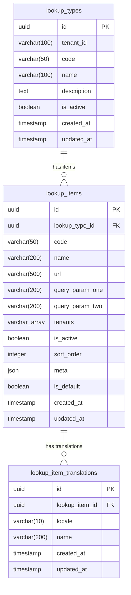

# Lookup Microservice Database Schema

## Entity Relationship Diagram (Mermaid)

## Tables

### lookup_types
| Column      | Type         | Default           | Constraints                          |
|-------------|-------------|-------------------|--------------------------------------|
| id          | uuid        | gen_random_uuid() | PK, NOT NULL                         |
| tenant_id   | varchar(100)| ''                | NOT NULL                             |
| code        | varchar(50) |                   | NOT NULL                             |
| name        | varchar(100)|                   | NOT NULL                             |
| description | text        |                   |                                      |
| is_active   | boolean     | true              | NOT NULL                             |
| created_at  | timestamp   | CURRENT_TIMESTAMP | NOT NULL                             |
| updated_at  | timestamp   | CURRENT_TIMESTAMP | NOT NULL                             |

**Indexes:**
- `idx_lookup_type_tenant_id` — on `(tenant_id)`
- `idx_lookup_type_tenant_code` — UNIQUE on `(tenant_id, code)`

### lookup_items
| Column          | Type         | Default           | Constraints         |
|-----------------|-------------|-------------------|---------------------|
| id              | uuid        | gen_random_uuid() | PK, NOT NULL        |
| lookup_type_id  | uuid        |                   | NOT NULL, FK → lookup_types.id (CASCADE) |
| code            | varchar(50) |                   | NOT NULL            |
| name            | varchar(200)|                   | NOT NULL            |
| url             | varchar(500)|                   |                     |
| query_param_one | varchar(200)|                   |                     |
| query_param_two | varchar(200)|                   |                     |
| tenants         | varchar[]   | '{}'              | NOT NULL            |
| is_active       | boolean     | true              | NOT NULL            |
| sort_order      | integer     | 0                 | NOT NULL            |
| meta            | json        | '{}'              | NOT NULL            |
| is_default      | boolean     | false             | NOT NULL            |
| created_at      | timestamp   | CURRENT_TIMESTAMP | NOT NULL            |
| updated_at      | timestamp   | CURRENT_TIMESTAMP | NOT NULL            |

**Indexes:**
- `idx_lookup_item_type` — on `(lookup_type_id)`
- `idx_lookup_item_type_code` — on `(lookup_type_id, code)`

### lookup_item_translations
| Column         | Type         | Default           | Constraints         |
|----------------|-------------|-------------------|---------------------|
| id             | uuid        | gen_random_uuid() | PK, NOT NULL        |
| lookup_item_id | uuid        |                   | NOT NULL, FK → lookup_items.id (CASCADE) |
| locale         | varchar(10) |                   | NOT NULL            |
| name           | varchar(200)|                   | NOT NULL            |
| created_at     | timestamp   | CURRENT_TIMESTAMP | NOT NULL            |
| updated_at     | timestamp   | CURRENT_TIMESTAMP | NOT NULL            |

**Indexes:**
- `idx_lookup_translation_item_locale` — UNIQUE on `(lookup_item_id, locale)`

## Migrations
1. `m20260403_000001_create_lookup_tables` — Creates all three tables with FKs and indexes
2. `m20260406_000002_add_meta_to_lookup_item` — Adds `meta` JSON column to lookup_items
3. `m20260406_000003_add_default_to_lookup_item` — Adds `is_default` boolean to lookup_items
4. `m20260407_000004_seed_countries` — Seeds country reference data
5. `m20260424_000005_add_tenant_id_to_lookup_type` — Adds `tenant_id` column, replaces unique `code` index with unique `(tenant_id, code)`
