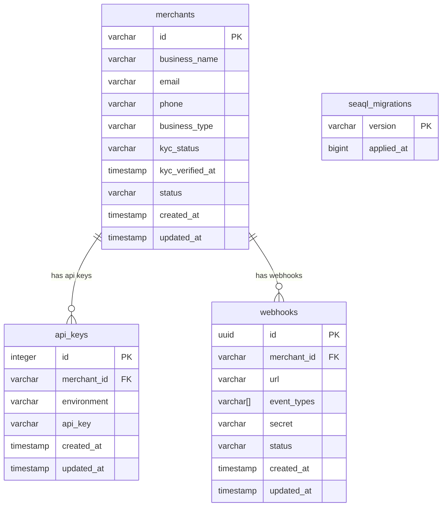

# Merchant Microservice Database Schema

## Entity Relationship Diagram (Mermaid)

## Database Schema (merchant)

### Tables

#### merchants
| Column         | Type      | Default           | Constraints         |
|---------------|-----------|-------------------|---------------------|
| id            | varchar(50)|                   | PK, NOT NULL        |
| business_name | varchar(255)|                  | NOT NULL            |
| email         | varchar(255)|                  | NOT NULL            |
| phone         | varchar(20)|                   |                     |
| business_type | varchar(50)|                   |                     |
| kyc_status    | varchar(20)|                   | NOT NULL            |
| kyc_verified_at| timestamp |                   |                     |
| status        | varchar(20)|                   | NOT NULL            |
| created_at    | timestamp | CURRENT_TIMESTAMP | NOT NULL            |
| updated_at    | timestamp | CURRENT_TIMESTAMP | NOT NULL            |

---

#### api_keys
| Column      | Type      | Default           | Constraints         |
|-------------|-----------|-------------------|---------------------|
| id          | integer   |                   | PK, NOT NULL        |
| merchant_id | varchar(50)|                   | NOT NULL, FK        |
| environment | varchar(50)|                   | NOT NULL            |
| api_key     | varchar(255)|                   | NOT NULL            |
| created_at  | timestamp | CURRENT_TIMESTAMP | NOT NULL            |
| updated_at  | timestamp | CURRENT_TIMESTAMP | NOT NULL            |

---

#### webhooks
| Column      | Type      | Default           | Constraints         |
|-------------|-----------|-------------------|---------------------|
| id          | uuid      | gen_random_uuid() | PK, NOT NULL        |
| merchant_id | varchar(50)|                   | NOT NULL, FK        |
| url         | varchar(255)|                   | NOT NULL            |
| event_types | varchar[] |                   | NOT NULL            |
| secret      | varchar(255)|                   | NOT NULL            |
| status      | varchar(20)|                   | NOT NULL            |
| created_at  | timestamp | CURRENT_TIMESTAMP | NOT NULL            |
| updated_at  | timestamp | CURRENT_TIMESTAMP | NOT NULL            |

---

#### seaql_migrations
| Column      | Type      | Default | Constraints         |
|-------------|-----------|---------|---------------------|
| version     | varchar   |         | PK                  |
| applied_at  | bigint    |         | NOT NULL            |

