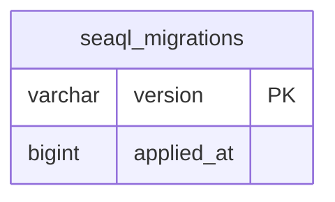

# Notification Microservice Database Schema

## Entity Relationship Diagram (Mermaid)

## Database Schema (notification)

### Tables

#### seaql_migrations
| Column      | Type      | Default | Constraints         |
|-------------|-----------|---------|---------------------|
| version     | varchar   |         | PK                  |
| applied_at  | bigint    |         | NOT NULL            |

