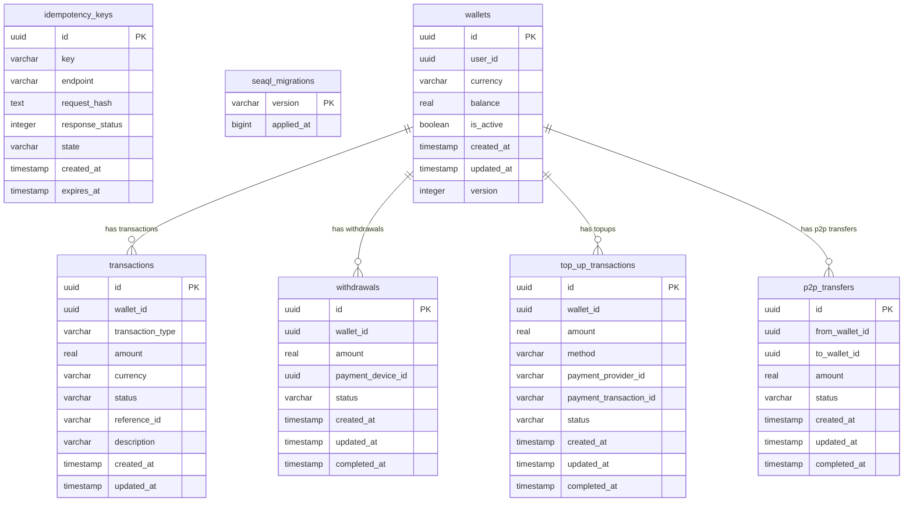

# Wallet Microservice Database Schema

## Entity Relationship Diagram (Mermaid)

## Database Schema (wallet)

### Tables

#### idempotency_keys
| Column         | Type      | Default           | Constraints         |
|---------------|-----------|-------------------|---------------------|
| id            | uuid      | gen_random_uuid() | PK, NOT NULL        |
| key           | varchar   |                   | NOT NULL            |
| endpoint      | varchar   |                   | NOT NULL            |
| request_hash  | text      |                   |                     |
| response_status| integer  |                   |                     |
| state         | varchar   | 'PENDING'         | NOT NULL            |
| created_at    | timestamp | CURRENT_TIMESTAMP | NOT NULL            |
| expires_at    | timestamp |                   |                     |

---

#### p2p_transfers
| Column         | Type      | Default           | Constraints         |
|---------------|-----------|-------------------|---------------------|
| id            | uuid      | gen_random_uuid() | PK, NOT NULL        |
| from_wallet_id| uuid      |                   | NOT NULL            |
| to_wallet_id  | uuid      |                   | NOT NULL            |
| amount        | real      |                   | NOT NULL            |
| status        | varchar   | 'PENDING'         | NOT NULL            |
| created_at    | timestamp | CURRENT_TIMESTAMP | NOT NULL            |
| updated_at    | timestamp | CURRENT_TIMESTAMP | NOT NULL            |
| completed_at  | timestamp |                   |                     |

---

#### seaql_migrations
| Column      | Type      | Default | Constraints         |
|-------------|-----------|---------|---------------------|
| version     | varchar   |         | PK                  |
| applied_at  | bigint    |         | NOT NULL            |

---

#### top_up_transactions
| Column                | Type      | Default           | Constraints         |
|-----------------------|-----------|-------------------|---------------------|
| id                    | uuid      | gen_random_uuid() | PK, NOT NULL        |
| wallet_id             | uuid      |                   | NOT NULL            |
| amount                | real      |                   | NOT NULL            |
| method                | varchar   |                   | NOT NULL            |
| payment_provider_id   | varchar   |                   |                     |
| payment_transaction_id| varchar   |                   |                     |
| status                | varchar   | 'PENDING'         | NOT NULL            |
| created_at            | timestamp | CURRENT_TIMESTAMP | NOT NULL            |
| updated_at            | timestamp | CURRENT_TIMESTAMP | NOT NULL            |
| completed_at          | timestamp |                   |                     |

---

#### transactions
| Column           | Type      | Default           | Constraints         |
|------------------|-----------|-------------------|---------------------|
| id               | uuid      | gen_random_uuid() | PK, NOT NULL        |
| wallet_id        | uuid      |                   | NOT NULL            |
| transaction_type | varchar   |                   | NOT NULL            |
| amount           | real      |                   | NOT NULL            |
| currency         | varchar   |                   | NOT NULL            |
| status           | varchar   | 'PENDING'         | NOT NULL            |
| reference_id     | varchar   |                   |                     |
| description      | varchar   |                   |                     |
| created_at       | timestamp | CURRENT_TIMESTAMP | NOT NULL            |
| updated_at       | timestamp | CURRENT_TIMESTAMP | NOT NULL            |

---

#### wallets
| Column      | Type      | Default           | Constraints         |
|-------------|-----------|-------------------|---------------------|
| id          | uuid      | gen_random_uuid() | PK, NOT NULL        |
| user_id     | uuid      |                   | NOT NULL            |
| currency    | varchar   | 'USD'             | NOT NULL            |
| balance     | real      | 0                 | NOT NULL            |
| is_active   | boolean   | true              | NOT NULL            |
| created_at  | timestamp | CURRENT_TIMESTAMP | NOT NULL            |
| updated_at  | timestamp | CURRENT_TIMESTAMP | NOT NULL            |
| version     | integer   | 1                 | NOT NULL            |

---

#### withdrawals
| Column           | Type      | Default           | Constraints         |
|------------------|-----------|-------------------|---------------------|
| id               | uuid      | gen_random_uuid() | PK, NOT NULL        |
| wallet_id        | uuid      |                   | NOT NULL            |
| amount           | real      |                   | NOT NULL            |
| payment_device_id| uuid      |                   |                     |
| status           | varchar   | 'PENDING'         | NOT NULL            |
| created_at       | timestamp | CURRENT_TIMESTAMP | NOT NULL            |
| updated_at       | timestamp | CURRENT_TIMESTAMP | NOT NULL            |
| completed_at     | timestamp |                   |                     |

