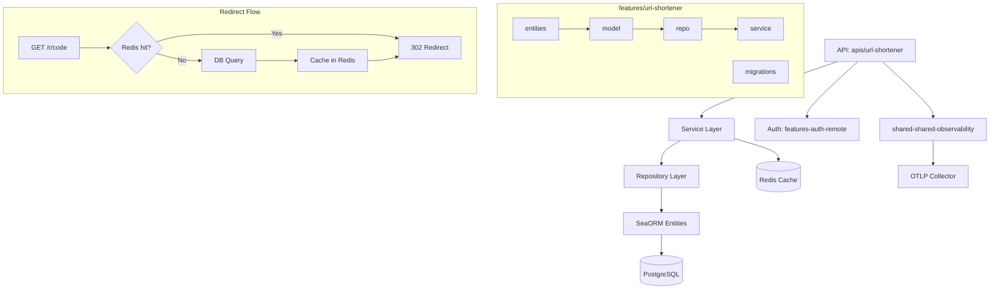

# Implementation Plan - URL Shortener Microservice

## Problem Statement

Build a URL shortener microservice that integrates with the existing Rust monorepo architecture, providing full-featured URL shortening with user authentication, custom short codes, click analytics, link expiration, API keys, custom OpenTelemetry metrics, Redis caching for redirects, and a dashboard API.

## Requirements

- Microservice following the same layered architecture (entities → model → repo → service → API)
- Uses existing auth system via `features-auth-remote` (JWT + RBAC permission system)
- Auto-generated short codes (7 chars, base62) + custom user-defined short codes with collision checking
- Click tracking/analytics (visitor IP, user-agent, referrer, timestamp)
- Link expiration (optional TTL per link) with custom HTML error page for expired/inactive links
- API keys for programmatic access
- Dashboard API (list links, view stats)
- Standard HTTP metrics via existing `shared-shared-observability` + custom counters (redirects_total, urls_created_total, expired_redirects_total)
- Redis caching for redirect lookups (`short_code → URL data`) with TTL and invalidation on update/delete
- Named `url-shortener` throughout

## Background

- Rust workspace monorepo: Axum, Sea-ORM (PostgreSQL), Tokio, Utoipa (Swagger)
- Each feature has sub-crates: `entities`, `model`, `repo`, `service`, `migrations`
- APIs are separate binaries under `apis/` wiring features together via `StartApp` trait
- Permissions defined with `define_resource_perms!` macro, checked via `Auth<T>` extractor
- `shared-shared-observability` provides: OTLP logs, traces, HTTP metrics, rolling file appender
- `shared-shared-data-cache` provides a generic `Cache<K, V>` backed by Redis with TTL support
- Custom metrics use `opentelemetry::global::meter()` to create counters/histograms exported via OTLP

## Proposed Solution



## Database Schema

- `shortened_urls`: id (UUID PK), user_id (UUID), original_url (TEXT NOT NULL), short_code (VARCHAR(30) UNIQUE NOT NULL), title (VARCHAR(255)), is_active (BOOL DEFAULT true), expires_at (TIMESTAMP nullable), click_count (BIGINT DEFAULT 0), created_at (TIMESTAMP), updated_at (TIMESTAMP)
- `url_clicks`: id (UUID PK), url_id (UUID FK → shortened_urls.id), ip_address (VARCHAR(45)), user_agent (TEXT), referrer (TEXT), country (VARCHAR(2)), clicked_at (TIMESTAMP)
- `api_keys`: id (UUID PK), user_id (UUID), key_hash (VARCHAR(64) UNIQUE NOT NULL), name (VARCHAR(100)), is_active (BOOL DEFAULT true), last_used_at (TIMESTAMP nullable), created_at (TIMESTAMP)

## Caching Strategy

- Key: `url_shortener:{short_code}`
- Value: Serialized `{original_url, expires_at, is_active, url_id}` (minimal data needed for redirect)
- TTL: 5 minutes
- Invalidation: On update or delete of a shortened URL, remove the corresponding Redis key

## Task Breakdown

### Task 1: Scaffold the feature crate structure and workspace integration

**Objective:** Create the full directory structure for `features/url-shortener/` with sub-crates (entities, model, repo, service, migrations) and `apis/url-shortener/`, then register them in the workspace `Cargo.toml`.

**Implementation:**

- Create `features/url-shortener/entities/Cargo.toml` and `src/lib.rs`
- Create `features/url-shortener/model/Cargo.toml` and `src/lib.rs`
- Create `features/url-shortener/repo/Cargo.toml` and `src/lib.rs`
- Create `features/url-shortener/service/Cargo.toml` and `src/lib.rs`
- Create `features/url-shortener/migrations/Cargo.toml` and `src/lib.rs` + `src/main.rs`
- Create `apis/url-shortener/Cargo.toml` and `src/main.rs` + `src/lib.rs`
- Add all crates to workspace `members` in root `Cargo.toml`
- Add workspace dependency entries (`features-url-shortener-entities`, etc.)
- Follow naming conventions from existing features (e.g., `features-lookup-entities`)

**Test:** `cargo check -p features-url-shortener-entities` and each crate passes.

**Demo:** All crates compile as empty shells; `cargo build` succeeds for the entire workspace.

---

### Task 2: Define entities for `shortened_urls` table

**Objective:** Create the Sea-ORM entity for the `shortened_urls` table with the `#[derive(Dto)]` macro.

**Implementation:**

- `features/url-shortener/entities/src/shortened_url.rs`: Define `Model` struct with all fields (id, user_id, original_url, short_code, title, is_active, expires_at, click_count, created_at, updated_at)
- Use `#[dto(name(ShortenedUrlForCreate), columns(user_id, original_url, short_code, title, expires_at))]`
- Use `#[dto(name(ShortenedUrlForUpdate), columns(title, is_active, expires_at), option)]`
- Implement `ActiveModelBehavior` for auto UUID + timestamps
- Export in `lib.rs`

**Test:** Compile check; DTO types are generated correctly.

**Demo:** `ShortenedUrlForCreateDto` and `ShortenedUrlForUpdateDto` are available as types.

---

### Task 3: Define entities for `url_clicks` and `api_keys` tables

**Objective:** Create Sea-ORM entities for analytics and API key tables.

**Implementation:**

- `features/url-shortener/entities/src/url_click.rs`: id, url_id, ip_address, user_agent, referrer, country, clicked_at. Use `#[dto(name(UrlClickForCreate), columns(url_id, ip_address, user_agent, referrer, country))]`.
- `features/url-shortener/entities/src/api_key.rs`: id, user_id, key_hash, name, is_active, last_used_at, created_at. Use `#[dto(name(ApiKeyForCreate), columns(user_id, key_hash, name))]`.
- Define `Relation`: `ShortenedUrl` has_many `UrlClick`.
- Export all entities in `lib.rs`.

**Test:** Compile check; relations compile.

**Demo:** All three entities compile with proper relations established.

---

### Task 4: Create database migrations

**Objective:** Write Sea-ORM migrations to create all three tables with proper indexes and constraints.

**Implementation:**

- `features/url-shortener/migrations/src/m20260715_000001_create_url_shortener_tables.rs`:
  - Create `shortened_urls` table with UNIQUE index on `short_code`, index on `user_id`
  - Create `url_clicks` table with FK to `shortened_urls.id`, index on `(url_id, clicked_at)`
  - Create `api_keys` table with UNIQUE index on `key_hash`, index on `user_id`
- `migrations/src/lib.rs`: Register migration in `Migrator`
- `migrations/src/main.rs`: Standard migration binary entry point

**Test:** Migration binary compiles successfully.

**Demo:** `cargo build -p features-url-shortener-migrations` succeeds; migration binary is ready to run.

---

### Task 5: Build the model layer (request/response types, state)

**Objective:** Create model types for request validation, response serialization, filter params, and app state.

**Implementation:**

- `model/src/shortened_url.rs`:
  - `ShortenedUrlData` (response DTO) with `#[derive(Response, ParamFilter)]`
  - `CreateShortenedUrlRequest` with validators: `original_url` (required, valid URL format), `custom_code` (optional, length 3-30, alphanumeric + hyphens), `title` (optional, max 255), `expires_at` (optional)
  - `UpdateShortenedUrlRequest`: title, is_active, expires_at (all optional)
  - `From<ModelOptionDto>` impl
- `model/src/url_click.rs`:
  - `UrlClickData` (response), `ClickStats` (aggregated: total_clicks, clicks_by_day, top_referrers, top_countries)
- `model/src/api_key.rs`:
  - `ApiKeyData` (response — key only shown on creation), `CreateApiKeyRequest` (name field)
- `model/src/state.rs`: `UrlShortenerAppState`, `UrlShortenerCacheState`
- `model/src/cache.rs`: `CachedUrlData` struct (minimal: original_url, expires_at, is_active, url_id) — the value stored in Redis

**Test:** Compile check; `Validate` trait on request types works.

**Demo:** All model types compile with Serialize/Deserialize/ToSchema/Validate.

---

### Task 6: Implement the repository layer for `shortened_urls`

**Objective:** Build query and mutation repos for shortened URLs using the project's macro-based pattern.

**Implementation:**

- `repo/src/shortened_url/mutation.rs`: `#[derive(Mutation)]` — create, update_by_id, delete_by_id, increment_click_count (atomic `UPDATE SET click_count = click_count + 1`)
- `repo/src/shortened_url/query.rs`: `#[derive(Query)]` — filter (list with user_id), get_by_id, custom `get_by_short_code` method
- `repo/src/shortened_url/util.rs`: Column assignment helper
- `repo/src/shortened_url/mod.rs`: Re-exports

**Test:** Unit tests with Sea-ORM mock DB for create, get_by_short_code, update, delete.

**Demo:** CRUD operations pass tests with mock DB.

---

### Task 7: Implement the repository layer for `url_clicks` and `api_keys`

**Objective:** Build repos for click recording and API key management.

**Implementation:**

- `repo/src/url_click/mutation.rs`: record_click (insert)
- `repo/src/url_click/query.rs`: get_clicks_by_url_id (paginated), get_click_count_by_url_id, get_clicks_by_date_range
- `repo/src/api_key/mutation.rs`: create, update (last_used_at), soft delete (set is_active=false)
- `repo/src/api_key/query.rs`: get_by_key_hash, list_by_user_id
- `repo/src/lib.rs`: Re-export all query/mutation types

**Test:** Unit tests with mock DB for click insertion, API key lookup by hash.

**Demo:** Click recording and API key lifecycle pass tests.

---

### Task 8: Implement the service layer (URL shortening core logic + Redis caching)

**Objective:** Business logic for creating short URLs, generating unique codes, handling redirects, and Redis cache integration.

**Implementation:**

- `service/src/shortened_url.rs` — `ShortenedUrlService`:
  - `create_short_url(req)`: Validate URL format, generate 7-char base62 code (using `rand`) or validate custom code uniqueness via DB lookup, save to DB, cache in Redis.
  - `get_by_short_code(code)`: Check Redis cache first → if hit, return cached data. If miss, query DB, cache result with 5-min TTL, return.
  - `redirect(code, ip, user_agent, referrer)`: Call `get_by_short_code` → if valid (not expired, is_active), spawn fire-and-forget task to record click + increment DB counter → return original URL. If expired/inactive, return specific error variant.
  - `update_short_url(id, user_id, req)`: Verify ownership, update DB, invalidate Redis cache for the short_code.
  - `delete_short_url(id, user_id)`: Verify ownership, delete from DB, invalidate Redis cache.
  - `list_user_urls(user_id, pagination, filters, order)`: Paginated listing (no cache).
- `service/src/cache.rs`: Helper wrapping `shared_shared_data_cache::cache::Cache<String, CachedUrlData>` with key prefix `url_shortener`, TTL 5 min. Methods: `get_url(code)`, `set_url(code, data)`, `invalidate(code)`.
- Short code generation: charset `[a-zA-Z0-9]` (62 chars), 7 chars, retry on collision (max 3 attempts).

**Test:** Unit tests for code generation, expiration check, URL validation, ownership verification. Test cache hit/miss paths with mocked cache.

**Demo:** Service methods pass all tests including cache hit (no DB call), cache miss (DB call + cache write), and invalidation on update/delete.

---

### Task 9: Implement the service layer (analytics and API keys)

**Objective:** Services for click analytics and API key management.

**Implementation:**

- `service/src/url_click.rs` — `UrlClickService`:
  - `record_click(url_id, ip, user_agent, referrer)`: Insert click record.
  - `get_click_stats(url_id, date_range)`: Aggregate clicks by day, top referrers, top countries.
  - `get_clicks(url_id, pagination)`: Paginated raw click list.
- `service/src/api_key.rs` — `ApiKeyService`:
  - `create_api_key(user_id, name)`: Generate 32-byte random key, store SHA-256 hash, return plaintext key once.
  - `validate_api_key(key)`: Hash provided key, lookup in DB, update `last_used_at`.
  - `revoke_api_key(id, user_id)`: Verify ownership, set is_active=false.
  - `list_user_keys(user_id)`: List user's API keys (without hashes).

**Test:** Unit tests for key generation, hash validation, analytics aggregation logic.

**Demo:** API key lifecycle (create, validate, revoke) and click stats pass tests.

---

### Task 10: Implement custom OpenTelemetry metrics

**Objective:** Add URL-shortener-specific counters and histograms exported via OTLP.

**Implementation:**

- `service/src/metrics.rs` — `UrlShortenerMetrics`:
  - Initialize a `Meter` via `opentelemetry::global::meter("url_shortener")`
  - `url_shortener.redirects_total` (Counter<u64>): Incremented on every successful redirect. Labels: `status` (success/expired/inactive).
  - `url_shortener.urls_created_total` (Counter<u64>): Incremented on new URL creation. Labels: `code_type` (auto/custom).
  - `url_shortener.expired_redirects_total` (Counter<u64>): Incremented on expired/inactive redirect attempt.
  - `url_shortener.redirect_latency` (Histogram<f64>): Time to resolve short code to redirect (including cache lookup).
  - `url_shortener.cache_hits_total` (Counter<u64>): Redis cache hits for redirect lookups.
  - `url_shortener.cache_misses_total` (Counter<u64>): Redis cache misses.
- Use `once_cell::sync::Lazy` to hold metric instruments globally.
- Integrate counter increments into `ShortenedUrlService::redirect()` and `create_short_url()`.

**Test:** Unit test that metrics struct initializes without panic.

**Demo:** Metrics instruments are created at startup; redirect and create operations increment correct counters.

---

### Task 11: Build the API binary with routes, permissions, and error pages

**Objective:** Create `apis/url-shortener/` with Axum app, routes, permissions, Swagger docs, and custom HTML error page.

**Implementation:**

- `apis/url-shortener/src/permission.rs`:
  ```rust
  define_resource_perms! {
      CanCreateUrl => (CREATE, "URL_SHORTENER:URL"),
      CanUpdateUrl => (UPDATE, "URL_SHORTENER:URL"),
      CanDeleteUrl => (DELETE, "URL_SHORTENER:URL"),
      CanViewAnalytics => (READ, "URL_SHORTENER:ANALYTICS"),
      CanManageApiKeys => (CREATE, "URL_SHORTENER:API_KEY"),
      CanDeleteApiKey => (DELETE, "URL_SHORTENER:API_KEY")
  }
  ```
- `apis/url-shortener/src/routes/shortened_url.rs`:
  - `POST /urls` — create (Auth required)
  - `GET /urls` — list user's URLs (Auth required)
  - `GET /urls/{id}` — get details (Auth required)
  - `PATCH /urls/{id}` — update (Auth required)
  - `DELETE /urls/{id}` — delete (Auth required)
- `apis/url-shortener/src/routes/redirect.rs`:
  - `GET /r/{code}` — public redirect endpoint. Returns 302 on success, custom HTML error page on expired/inactive.
- `apis/url-shortener/src/routes/url_click.rs`:
  - `GET /urls/{id}/clicks` — paginated clicks (Auth required)
  - `GET /urls/{id}/stats` — aggregated analytics (Auth required)
- `apis/url-shortener/src/routes/api_key.rs`:
  - `POST /api-keys` — create key (Auth required)
  - `GET /api-keys` — list keys (Auth required)
  - `DELETE /api-keys/{id}` — revoke key (Auth required)
- `apis/url-shortener/src/app.rs`: Bootstrap with `StartApp` trait — migrate, register routes, permission sync loop, `HttpMetricsLayerBuilder` for standard metrics, initialize Redis cache connection.
- `apis/url-shortener/src/doc.rs`: Utoipa OpenAPI config.
- `apis/url-shortener/src/error_page.rs`: HTML template for expired/inactive link error page (simple, styled HTML returned with `Content-Type: text/html`).

**Test:** Integration tests following `apis/lookup/tests/` pattern — test route handlers with mock DB.

**Demo:** API starts, Swagger UI at `/swagger-ui`, all endpoints respond correctly, redirect returns 302, expired links show HTML error page.

---

### Task 12: Add Docker and gateway configuration

**Objective:** Add Dockerfile, docker-compose entry, migration setup, and gateway routing.

**Implementation:**

- `docker/apis/url-shortener/Dockerfile`: Multi-stage build following existing API Dockerfiles.
- `docker/migrations/url-shortener/Dockerfile`: Migration runner.
- Add service entries in `docker/docker-compose.yml` for the API and migration runner.
- Add routing in `docker/gateway/dn-config.yaml`:
  - `/urls` → url-shortener service (auth interceptor enabled)
  - `/api-keys` → url-shortener service (auth interceptor enabled)
  - `/r/{code}` → url-shortener service (public, no auth interceptor)
- Update `start.sh` to include the url-shortener service.

**Test:** Docker build succeeds; gateway config is valid YAML.

**Demo:** Service starts via Docker, migrations run, gateway correctly routes requests to the url-shortener including the public redirect path.
